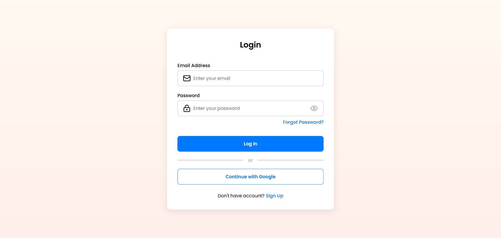
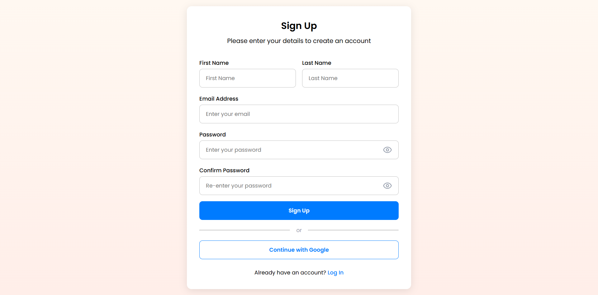

# Front-End Assignment

- Design a Login &amp; Registration page of your creativity using React Typescript (CRA/create-
react-app).
- Set the Port to run the yarn start command to Port 3333. [Please make sure to use
Typescript]
- Commit your work either through GitHub or GitLab &amp; create a new project entitled as
project-react including a simple README.md file, attachments of the login &amp; registration
page of your work.

- [Run The App](#run-the-app)
- [Attachment](#attachment)
  - [Screenshots](#screenshots) 
    - [Login Page](#login-page)
    - [Registration Page](#registration-page)
  - [Video](#video)

## Run The App
**PORT** = 3333
```bash
yarn start
```

## Attachment

### Screenshots
#### Login Page


#### Registration Page


### Video
Watch the video [here](./assets/attachment/video.webm)
